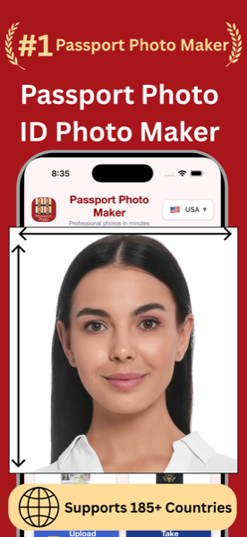
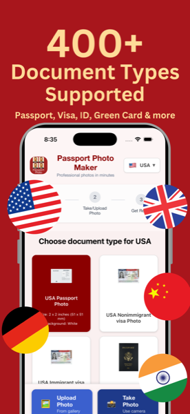
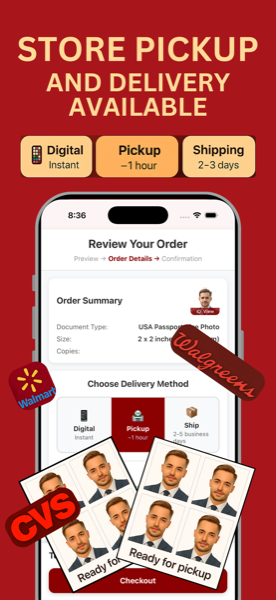
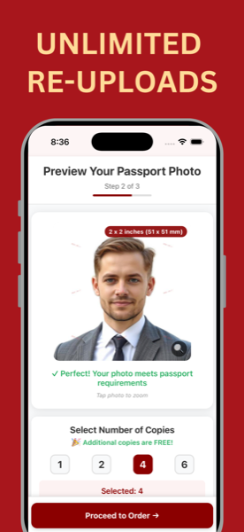
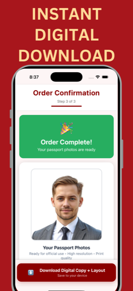
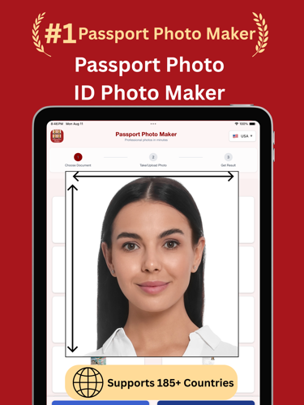
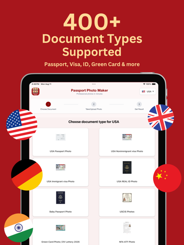
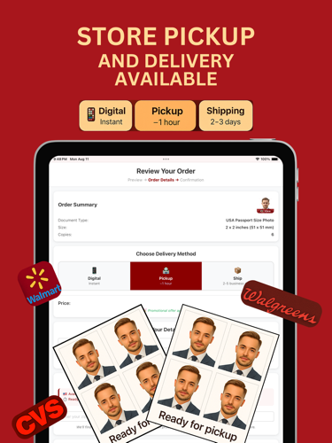
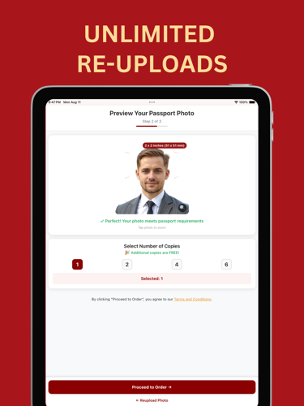

<p align="center">
  <a href="https://apps.apple.com/us/app/passport-photo-id-photo/id6748840005">
    
  </a>
</p>

<h1 align="center">Passport Photo Service</h1>

<p align="center">
  <em>I built a real, paying iOS product solo — ML pipeline, payments, mobile, infra.</em><br>
  This repo is the production backend. <strong>Solo-engineered. Live in the App Store. AI-pair-programmed end-to-end.</strong>
</p>

<p align="center">
  
  
  
  
  
  
  
  
  
  
  
  <a href="https://apps.apple.com/us/app/passport-photo-id-photo/id6748840005"></a>
</p>

<p align="center"><strong>4.9★ on the App Store · 100+ downloads/month · 7 country specs · solo-built end-to-end</strong></p>

<p align="center"><a href="https://apps.apple.com/us/app/passport-photo-id-photo/id6748840005"></a></p>

---

## What Is This

This is the **production server** behind [Passport Photo, ID Photo](https://apps.apple.com/us/app/passport-photo-id-photo/id6748840005) — an iOS app that takes a user's selfie and generates a country-compliant passport photo, plus a 4×6 print sheet, in seconds.

It runs in production, serves real paying customers, and was built solo:

- **ML inference pipeline** — portrait matting (background removal) + face-landmark detection + dynamic crop math per country specification (US, Canada, UK, India, EU Schengen, baby passport, plus arbitrary custom sizes)
- **Order + payment lifecycle** — Stripe (cards + webhooks), PayPal (sandbox + live), Apple IAP receipt validation
- **Fulfillment** — direct digital download or Walgreens print-API integration for in-store pickup
- **Transactional email** — Microsoft Graph API for order confirmations, async-offloaded so payment latency stays sub-second
- **Infrastructure as code** — Terraform-managed GCP (Cloud Run, Cloud SQL, Cloud Storage, Secret Manager, Artifact Registry, custom-domain mapping)

> **This is not a tutorial clone.** Real users. Real Stripe charges. Real Cloud SQL. Real Cloud Run revisions in `us-central1`. The endpoints in this repo are the endpoints that handle live orders today.

## The Mobile Client

The iOS app — built with React Native + Expo — sits on top of these endpoints. Country selector → camera/upload → server-side processing → preview → checkout (Stripe / PayPal / Apple IAP) → digital download or Walgreens print pickup.

<p align="center">
  
  
  
  
  
</p>

<details>
<summary><strong>iPad screenshots</strong></summary>

<p align="center">
  
  
  
  
  
</p>
</details>

The mobile client lives in a separate repo (private — it's the active commercial asset). This backend is open-sourced as the portfolio piece.

## Why This Repo Exists

I shipped this product solo to prove to myself I could own a system end-to-end — ML, mobile, payments, infra, support, the whole lifecycle.

I did. It's live. It pays. This repo is the receipt.

It's also the clearest demonstration I have of how I work in 2026: **with an LLM in every loop, building at a velocity I could not match alone.** See [Built with AI Pair Programming](#built-with-ai-pair-programming) below.

## Architecture

```
┌──────────────┐    HTTPS    ┌──────────────────────────┐
│  iOS app     │  ────────▶  │  Cloud Run (Flask)       │
│ (React       │             │   /process               │
│  Native)     │  ◀────────  │   /createOrder           │
└──────────────┘             │   /getCost  /healthz     │
                             │   /paypal/* /stripe/*    │
                             └──┬───────┬──────────┬────┘
                                │       │          │
                  ┌─────────────┘       │          └────────────┐
                  ▼                     ▼                       ▼
          ┌──────────────┐    ┌────────────────────┐   ┌──────────────────┐
          │ Cloud SQL    │    │ Cloud Storage      │   │ External APIs    │
          │ (MySQL)      │    │ (processed photos, │   │ Stripe, PayPal,  │
          │ orders,      │    │ composites)        │   │ Walgreens, MS    │
          │ referrals    │    │                    │   │ Graph (email)    │
          └──────────────┘    └────────────────────┘   └──────────────────┘

Per-request inside Cloud Run:
  selfie ─▶ portrait matting (alpha mask)
        ─▶ face_recognition (68-pt landmarks)
        ─▶ dynamic crop (eye-line ratio · head-to-frame ratio · chin padding per spec)
        ─▶ resize to country dimensions @ 300dpi
        ─▶ composite 4×6 print sheet
        ─▶ upload to GCS ─▶ return signed URLs
```

## Features

| Feature | What it actually does |
|---|---|
| **Country-aware crop engine** | 7 built-in document specs (US passport, Canada, UK, India, EU Schengen, baby passport, US visa) plus arbitrary custom dimensions from the mobile app's config payload. Eye-line + head-ratio + chin-padding all computed dynamically per face. |
| **Payments — three rails** | Stripe (cards + idempotent webhook handling), PayPal (sandbox + live, with TTL-cached access tokens), Apple IAP (receipt validation against `verifyReceipt`). All three converge into a single `orders` table. |
| **Print fulfillment** | Direct integration with the Walgreens print API — quote → product lookup → store lookup → order submit, all from a single `/createOrder` request. |
| **Async email + GCS offload** | Order confirmation emails (with photo + composite as base64 attachments via Microsoft Graph) run in a daemon thread so the user-facing payment-confirm response stays fast. |
| **Promo mode** | Server-side feature flags drive a "free for now" promo that the mobile app reads from `/getCost`. Toggleable without an app-store update. |
| **Infra-as-code** | Full GCP project provisioning — Cloud Run, Cloud SQL (MySQL), Cloud Storage, Artifact Registry, Secret Manager bind-by-name, optional custom-domain mapping with manual ownership-verification gating. |
| **Cold-start optimized** | gunicorn `--preload` so the matting model loads once in master and is inherited by all 4 workers. Saves ~300ms × 3 workers per cold start. |
| **Health probes** | `/healthz` and `/_ah/health` for Cloud Run + uptime checks; deliberately don't touch DB/GCS so they don't fail the pod when downstream is flaky. |

## Tech Stack

| Layer | Tools |
|---|---|
| **Runtime** | Python 3 · Flask · gunicorn (`--preload`, 4 workers, 120s timeout, keepalive 5) · `flask-compress` for gzip JSON |
| **ML** | MODNet (semantic matting / background removal) · `face_recognition` (HOG + CNN dlib) for 68-point landmarks · OpenCV + PIL for compositing |
| **Storage** | Cloud SQL (MySQL) with connection pooling · Cloud Storage with signed URLs |
| **Payments** | Stripe (Python SDK + webhook signature verification) · PayPal REST (TTL token cache) · Apple IAP (StoreKit receipt validation) |
| **Email** | Microsoft Graph API (`sendMail`) for transactional with attachment support · MSAL for OAuth · SMTP fallback |
| **Fulfillment** | Walgreens print API (REST, JSON) · Browser-Use (LLM-driven browser automation) for Google Photos / Walmart upload paths |
| **Infra** | GCP Cloud Run · Cloud Build · Artifact Registry · Secret Manager · custom-domain mapping. **Everything provisioned via Terraform.** |
| **Mobile** (separate repo) | React Native + Expo |

## Endpoints

| Endpoint | Purpose |
|---|---|
| `POST /process` | Upload selfie → returns processed-image token |
| `GET /preview/<token>` | Preview before paying |
| `POST /change-background` | Re-render same photo with a new background color |
| `POST /createOrder` | Create order, charge Stripe/PayPal/IAP, send confirmation email, kick off fulfillment |
| `POST /stripe/webhook` | Handle `payment_intent.succeeded` etc., idempotent |
| `GET /getCost` | Pricing + active promo flags (frontend reads on launch) |
| `GET /_ah/health`, `/healthz` | Cloud Run readiness + uptime probes |

## Built with AI Pair Programming

I was rarely the only one in the room.

I used **Claude Code** (Anthropic's CLI agent) as a daily-driver pair-programming partner through every phase of this product:

- **Architecture conversations.** Sketched the request lifecycle, the Cloud Run + Cloud SQL + GCS topology, the failure modes of synchronous vs. async fulfillment, and the trade-offs of running the matting model in-process vs. behind a model server. The decision to keep it in-process with gunicorn `--preload` came out of one of those conversations.
- **Prompt-engineered subsystems end-to-end.** The dynamic-crop geometry in `utils/process_images.py` (eye-line ratios, head-to-frame ratios, chin padding per country spec) was iterated on with the LLM as a CV / math reviewer. I'd describe a failure mode on a real test image, paste the offending output, and we'd refine the formula together.
- **Agent-driven third-party integration.** The Walgreens fulfillment path and the Google Photos upload helper were prototyped with **[Browser-Use](https://github.com/browser-use/browser-use)** (LLM-driven browser automation) before I knew if first-party APIs even covered the flow I needed. That let me validate the user experience end-to-end in days, then swap to the real REST API once I had a working spec.
- **Code review on every change.** Catches I remember: a torch tensor leaking memory because it wasn't inside a `with torch.no_grad():` block, a Stripe webhook handler that wasn't idempotent, a face-detection pre-downscale that should have been gated on input resolution.
- **Infra-as-code authoring.** The entire Terraform module — Cloud Run, Cloud SQL, custom-domain mapping with manual ownership-verification gating, Secret Manager bind-by-name, Artifact Registry — was authored in a long iterative session: I described the deployment shape I wanted, it produced HCL, I applied + broke + iterated.
- **Persistent project memory.** I keep durable project notes that the LLM reads at the start of every session, so context like *"composite generation is required even for digital orders, because users still want to print 4 copies themselves"* survives across days. That memory is the difference between an assistant that helps and one that constantly re-introduces yesterday's bugs.

> **The result:** a real, deployed, paying-customer product I built solo in months — at a velocity that would not have been possible without aggressive use of LLM tooling. I think this is the shape of how senior engineers will work; I wanted to demonstrate I'm already doing it.

## Quick Start

```bash
# 1. Clone
git clone https://github.com/poshan11/PassportPhotoMakerV2.git
cd PassportPhotoMakerV2

# 2. Python deps
python3 -m venv .venv && source .venv/bin/activate
pip install -r requirements.txt

# 3. MODNet model weights (not redistributed — pull from upstream)
git clone https://github.com/ZHKKKe/MODNet.git
# Then download modnet_photographic_portrait_matting.ckpt from MODNet's
# release page and place it at MODNet/ckpt/

# 4. Config
cp .env.example .env   # fill in DB, GCS, Stripe, PayPal, etc.
export $(cat .env | xargs)

# 5. Run
gunicorn -w 4 --preload --timeout 120 -b 0.0.0.0:5001 apis:app
```

## Deploy to Your Own GCP Project

The full GCP project — Cloud Run service, Cloud SQL instance, Cloud Storage bucket, Artifact Registry repo, Secret Manager secrets, optional custom-domain mapping — is provisioned by Terraform.

```bash
cd terraform
cp terraform.tfvars.example terraform.tfvars   # fill in your values
terraform init
terraform apply
```

See [`terraform/README.md`](terraform/README.md) for the secret-handling options (raw values vs. Secret Manager bind-by-name) and the custom-domain setup.

## Project Structure

```
.
├── apis.py                      # Flask app, all REST endpoints (~31KB)
├── config.py                    # 12-factor config — every value from env
├── walgreens_api.py             # Print fulfillment integration
├── google_photos_automation.py  # Headless Google Photos upload helper
├── gcs_to_photos.py             # GCS → Google Photos sync utility
├── debug_face_detection.py      # CLI for trying face detectors on a single image
├── test_document_mappings.py    # Unit tests for country crop configs
├── tests/
│   └── test_live_cloud_run_api.py    # Post-deploy live integration test
├── utils/
│   ├── process_images.py        # MODNet + face_recognition + dynamic crop pipeline
│   ├── storage_utils.py         # GCS upload/download wrappers
│   ├── database.py              # MySQL connection pool + repositories
│   ├── order_utils.py           # Order/payment state machine
│   ├── orderconfirmationemail.py # MS Graph + email composition
│   ├── browser_use_automation.py # LLM-driven browser-automation tasks
│   ├── api_responses.py         # Response envelope helpers
│   ├── error_handler.py         # Flask error handlers
│   └── generic_utils.py         # Shared helpers
├── scripts/
│   └── smoke_test_cloud_run.sh  # Post-deploy smoke check
├── terraform/                   # GCP infra-as-code (Cloud Run, SQL, GCS, …)
├── Dockerfile
├── requirements.txt
├── create_referrals_table.sql   # Referrals table DDL
└── frontend_doc_config_example.js # Example doc-config payload from mobile
```

## License

MIT — see [LICENSE](LICENSE).

The MODNet model weights are licensed separately by their authors and are **not redistributed** in this repo.

## About Me

I'm **Poshan Bastola** — distributed-systems engineer, ~5 years on the Object Storage Platform at **Oracle Cloud Infrastructure** (exabyte-scale, 2,000+ servers, 25+ regions). I built the data pipeline (object storage → data lake → analytics warehouse), the Prometheus/Grafana observability stack, the per-tenant attribution model, and the Python forecasting model that became the canonical monthly input for global hardware procurement — driving fleet utilization 65% → 80% and reducing capex by millions/yr.

This repo is one of the things I've been building since.

## Let's Connect

[](https://linkedin.com/in/poshan-bastola)
[](https://apps.apple.com/us/app/passport-photo-id-photo/id6748840005)
[](mailto:poshanbastola93@gmail.com)
